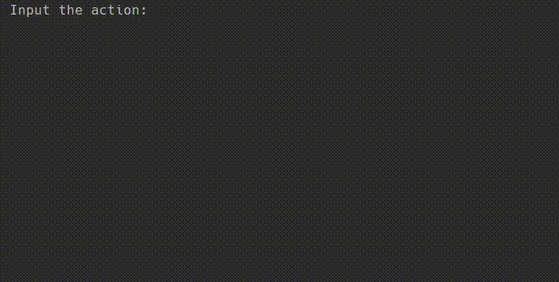

# _Flashcards_
Command line application which allows flashcards to be created and used for remembering definitions of terms. Have fun!

A flashcard is a digital or paper card that contains a term on one side, and a definition, translation, or explanation of that term on the other. 
Flashcards are often used for learning foreign languages and are an effective study technique for many people.

The program supports the following actions:

    add a card: add
    remove a card: remove
    load cards from file: import
    save cards to file: export
    ask for definitions of some random cards: ask
    exit the program: exit
    save the application log to the given file: log
    print the term or terms that the user makes most mistakes with: hardest card
    erase the mistake count for all cards: reset stats

Each time the user is prompted for their next action. The action is read from the next line, processed, 
and the message is output again until the user decides to exit the program.

The program's behavior depends on the user's input action.

When provided with command-line arguments, the program should do the following:

    If -import IMPORT is passed, where IMPORT is the file name, read the initial card set from the external file 
    and print the message n cards have been loaded. as the first line of the output, where n is the number of cards 
    loaded from the external file. If such an argument is not provided, the set of cards will initially be empty 
    and no message about card loading will be output.
    
    If -export EXPORT is passed, where EXPORT is the file name, write all cards that are in the program memory into this file after the user 
    has entered exit, and the last line of the output should be n cards have been saved., where n is the number of flashcards in the set.

